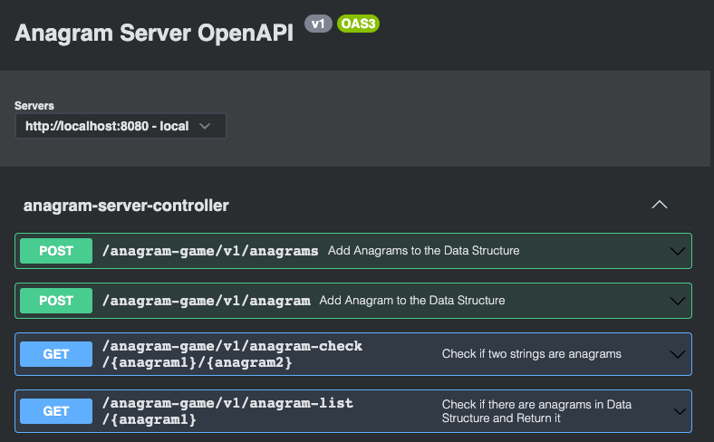
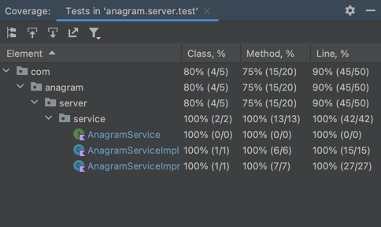

# Anagram Server - Backend

This repository contains the backend implementation of the Anagram Server, built with Spring Boot, Kotlin, and Redis.

## Getting Started

1. Clone the repository:

    ```
    git clone https://github.com/davidlourenco6/anagram.server
    cd anagram.server
    ```

2. Run tests (unit and int):

    ```
    ./gradlew test
    ```

3. Run the application:

    ```
    ./gradlew bootRun
    ```

## Swagger API Documentation

Explore the API endpoints accessing recourses/apiDocs/docs.json:



[ApiDocs File](src/main/resources/apiDocs/docs.json)

## Postman Collection

To get started, follow these simple steps:

1. Install Postman: If you haven't already, download and install Postman.

2. Import Collection: Download the collection file (./postman/anagram-server.postman_collection.json) from this repository and import it into your Postman app.

3. Explore Endpoints: Start exploring CRUD endpoints available in the collection. Each request is thoroughly documented with descriptions, headers, and example payloads in openAPI.
The collection is organized into different requests for functionality. Here's provided CRUD operations:

- addAnagrams
- addAnagram
- ensureAnagrams
- fetchAnagrams

[AnagramServer Collection](./postman/anagram-server.postman_collection.json)

## Code Coverage Evidences (run tests with coverage)


---
